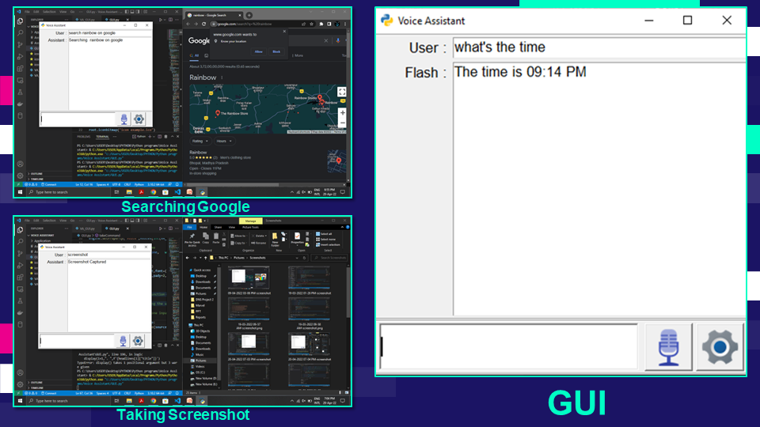
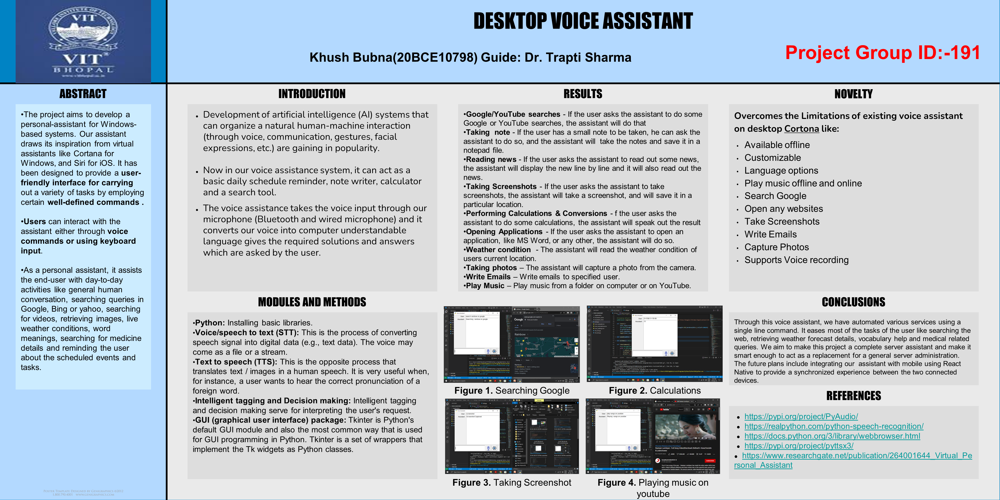

# Deskop-Voice-Assistant

Description: A Web based Voice Assistant bot using Python  to overcome the limitations of the existing voice assistant on windows (Microsoft’s Cortana) with a GUI for both voice and text command.

Technology: Python (GUI : Tkinter, pyttsx3) and online API’s

\

